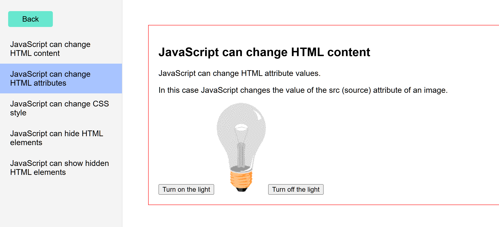

# two-ajax-blocks

# создаем эфективную базу знаний

## два блока - левый и правый.

### v.0.0.1

- имеем обе стороны, левая сторона подгружает правую

### v.0.0.2

- добовление вложеностей заголовков и вертикальнбого скрольинга 

### FUTURE PLANS

- добовление заголовков и папок для html и css

git add .
git commit -m "XXXXXXXXXXXXXXX"
git push

